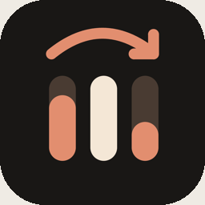
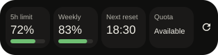
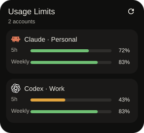
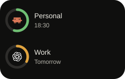

<p align="center"></p>

<h1 align="center">Usage Limits</h1>

<p align="center">
  <strong>How much of your AI subscription is left — and when it comes back.</strong><br>
  Codex, Claude, Antigravity, Grok and Kimi, side by side, on one screen and your home screen.<br>
  <sub><b>Available for Android and iOS.</b></sub>
</p>

<p align="center">
  <a href="https://github.com/ZepiGit/Usage-Limit-Viewer/actions/workflows/android.yml"></a>
  <a href="https://github.com/ZepiGit/Usage-Limit-Viewer/actions/workflows/ios.yml"></a>
  
  
</p>

---

Your AI subscriptions meter themselves in five different places, each with its own reset
clock: a five-hour Codex window, a weekly Claude window, Antigravity's per-model buckets,
Grok credits, Kimi coding quota. Usage Limits puts all of them on one screen, ranks them by
what needs attention next, and mirrors them onto your home screen — so the answer to "can I
keep going?" is a glance, not five browser tabs.

The app talks directly from your phone to each provider's own usage endpoint with your own
OAuth login (or, for Kimi, a key from your console). **There is no app-owned account and no
server**: credentials and cached usage stay on the device, and requests go to the providers.

## What it does

Four screens and a set of home-screen widgets, all reading the same local cache:

- **Overview** leads with the single window closest to running out across every account,
  then one card per account.
- **Accounts** lists what is connected; a tap opens every window the provider reports, and
  where a Codex reset credit can be spent.
- **Resets** is a chronological timeline of every upcoming rollover.
- **Settings** controls the sync interval and which notifications fire.

A background pass refreshes every account on a schedule (30 minutes by default, 15 minutes
minimum), and also on app start, on resume, and on the widget's refresh button. Accounts
refresh independently, so one expired token cannot stall the others — and when a refresh
fails, the previous numbers stay on screen with their real age instead of being blanked.
Widgets age their own cached numbers too: a tile crossing its staleness threshold says so
rather than silently presenting old data as current.

## Supported providers

| Provider | Login | What is read |
|---|---|---|
| **OpenAI Codex** (ChatGPT subscription) | Authorization code + PKCE in the system browser (device-code fallback) | Five-hour, weekly and (on some plans) monthly windows, code-review limits, and rate-limit reset credits — which can also be spent from the app |
| **Claude** (Anthropic subscription) | Authorization code + PKCE in the system browser | Five-hour window plus the weekly windows Anthropic reports, including per-model ones |
| **Antigravity** (Google) | Google installed-app authorization + PKCE | Quota buckets per model family, five-hour and weekly |
| **Grok** (xAI) | RFC 8628 device flow | Weekly credit usage and the monthly billing window |
| **Kimi Code** (Moonshot) | Device-code flow, or a pasted console key | Coding quota and reset windows |

All five have implementations on both platforms. Live account sign-in has not been verified
for every provider — see [Project status](#project-status).

## Home-screen widgets

Every subscription on your wallpaper, in four shapes on Android (compact summary, detailed
bars, account rings, mini rings) and as bars, rings and mini rings on iOS — configurable per
tile: which accounts, which panel colour, how much transparency, which text tone. Tap a tile
to open the app; tap an account to open that account.

<p align="center">
  
  &nbsp;&nbsp;
  
  &nbsp;&nbsp;
  
  &nbsp;&nbsp;
  
</p>

Widgets render from the app's local cache only — never from a provider, and never with your
credentials. On iOS the extension reads a snapshot the app writes into the shared App Group
container; on Android the widget layer reads only the local Room cache.

## Private by design

This is a meter, not a gateway — and the distinction is structural, not a promise:

- **No proxy, no API gateway.** The app accepts requests from nothing. The only socket it
  ever opens is a loopback listener for one OAuth redirect.
- **No model calls.** No completions, no chat, no embeddings — nothing that consumes the
  quota it reports on.
- **No backend, no telemetry, no analytics.** The only hosts contacted are the providers'
  own, listed in one file (`ProviderEndpoints`).
- **Credentials stay in the platform vault** — Android Keystore with AES-GCM, iOS Keychain —
  and never enter widget state, notifications, or logs.

The full threat model, including the risks that were accepted and why, is in
[docs/security.md](docs/security.md).

## Project status

Under active development, **install from source** — there are no store releases yet.

- Both test suites run in CI: Android (JVM + Robolectric, no emulator needed) and the iOS
  Swift package on Linux and macOS; the iOS app and widget are built with the real SDK and
  type-checked on Linux against framework shims. The badges at the top show the current state.
- The last full audit passed 400 Android tests and 456 Swift package tests, plus an API 36
  emulator smoke over screens, widget configuration and large text. Details and the remaining
  device checks: [docs/verification.md](docs/verification.md) and
  [docs/release-readiness.md](docs/release-readiness.md).
- **Live account sign-in is not verified for every provider**, and Kimi OAuth usage access
  may require vendor approval. Parser compatibility is covered by production-shaped fixtures,
  not by live credentials.

## Build

**Android** — JDK 21 for tests, an Android SDK with platform 36:

```bash
./gradlew :app:assembleDebug          # build
./gradlew :app:testDebugUnitTest      # test
```

**iOS** — the shared package builds anywhere Swift does; the app needs macOS with Xcode and
[XcodeGen](https://github.com/yonaskolb/XcodeGen):

```bash
swift test --package-path ios/UsageLimitsKit          # test the shared kit
cd ios/UsageLimits && xcodegen generate               # then open in Xcode
```

Key versions: Android `minSdk` 26 (Android 8.0), `targetSdk` 36, Kotlin 2.0, Compose,
Glance 1.2.0; iOS 16.0+, SwiftUI, WidgetKit. The debug build installs as
`com.usagelimits.debug` so it can sit alongside a release build.

## Documentation

| Document | What it covers |
|---|---|
| [docs/architecture.md](docs/architecture.md) | Layering, the `UsageProvider` abstraction, the normalised model, the sync pipeline |
| [docs/widgets.md](docs/widgets.md) | The widget kinds, the configuration model, and the Room-only data path |
| [docs/security.md](docs/security.md) | Threat model, credential storage, and the accepted risks |
| [docs/verification.md](docs/verification.md) | Test coverage, local results, and the remaining device runbook |
| [docs/release-readiness.md](docs/release-readiness.md) | Release audit evidence and outstanding final checks |
| [docs/compatibility.md](docs/compatibility.md) | Android version floor, foldables, RTL and accessibility |
| [docs/release.md](docs/release.md) | Building, testing and signing a real release |
| [docs/providers-…](docs/providers-codex.md) | One document per provider: auth flow, payload shapes, limits |

## Legal and stability

Read this before pointing the app at an account.

**These are not public APIs.** Several usage endpoints are internal to each vendor's own CLI
or desktop client. They are undocumented for third-party use, carry no compatibility
promise, and can change or disappear without notice. Parsers degrade to "one row missing"
rather than failing outright — but breakage over time is expected, not exceptional.

**This app is for accounts you personally control.** It authenticates as you, with your own
consent, and reads only your own quota. No multi-user or administrative mode exists.

**Permissibility must be reviewed before any public release.** Using a first-party client's
OAuth identifiers and internal endpoints from a third-party app may conflict with each
provider's terms — the answer likely differs per provider. Personal use of your own accounts
is the intended scope today; distributing the app requires reading each provider's current
terms first.

**What the app refuses to do to stay working:** it sends plain HTTPS with no TLS fingerprint
mimicry, challenge solving, or other bot-detection evasion. If a provider's edge rejects it,
the app reports a clear error. That decision is permanent, and it is the biggest feasibility
risk in the project.
